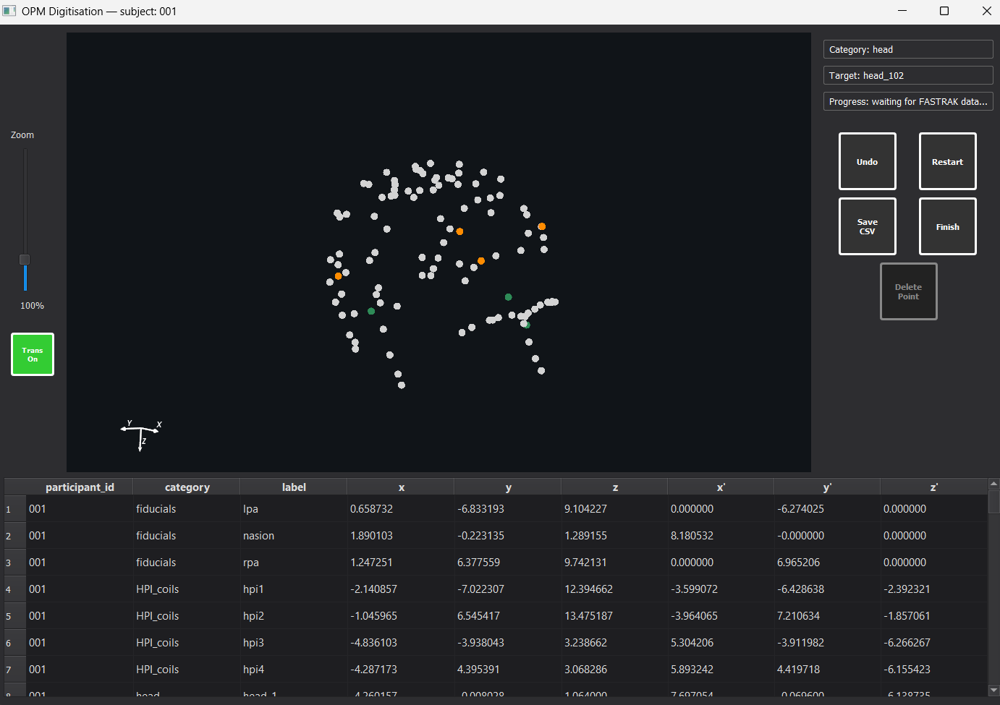

# pylhemus

`pylhemus` is a GUI workflow for Polhemus FASTRAK digitisation. It captures fiducials, HPI coils, and head-shape points, then exports the recorded coordinates to CSV.

Original code by [Laura B Paulsen](https://github.com/laurabpaulsen/OPM_lab).



## What It Does

- Launches a digitisation GUI for participant sessions
- Records raw FASTRAK coordinates
- Computes Neuromag/RAS coordinates once LPA, Nasion, and RPA are captured
- Autosaves sessions and can restore the latest unfinished session
- Supports a development mode with simulated hardware
- Includes command-line utilities for inspecting FASTRAK settings

## Installation

```bash
python -m pip install -e .
```

Python 3.10 or newer is required.

## Quick Start

Launch the GUI:

```bash
pylhemus gui
```

Common variants:

```bash
pylhemus gui --settings my_settings.json
pylhemus gui --port /dev/ttyUSB0
pylhemus gui --output-dir output
pylhemus gui --dev-mode
pylhemus gui --restore-last

# Open the settings dialog
pylhemus settings

# Read FASTRAK settings from a live device
pylhemus settings --dump
pylhemus settings --dump --out settings.json

# Apply previously saved device settings
pylhemus settings --apply --from settings.json

# Update user settings without connecting to a device
pylhemus settings --set-units inch
pylhemus settings --set-metal-compensation off
pylhemus settings --set-factory-defaults off

# Stream FASTRAK sample lines without the GUI
pylhemus stream --metric
pylhemus stream --parsed --max-lines 20
pylhemus stream --max-lines 20
pylhemus stream --continuous --max-lines 20

# Friendly FASTRAK command interface
pylhemus talk status
pylhemus talk receivers
pylhemus talk station --id 1
pylhemus talk set-units cm
pylhemus talk prepare
pylhemus talk send-raw S

# Run without installing
python -m pylhemus gui
python -m pylhemus settings
```

## Typical Workflow

1. Start `pylhemus`.
2. Enter a participant ID and choose a schema preset.
3. Capture the fiducials in order: LPA, Nasion, RPA.
4. Continue with HPI coils and head-shape points.
5. Save the session to CSV or finish the session from the GUI.

After all three fiducials are present, the GUI computes the Neuromag transform automatically and shows transformed coordinates alongside the raw coordinates.

## GUI Overview

### Left side

- Zoom slider
- Transform toggle button

### Right side

- Current category, target, and capture progress
- `Undo`, `Restart`, `Save CSV`, and `Finish` controls
- `Delete Point` for selected continuous head-shape points

### Table and plot

- Table columns: `participant_id`, `category`, `label`, `x`, `y`, `z`, `x_t`, `y_t`, `z_t`
- Table selection highlights the point in the 3D view
- Clicking a point in the 3D view selects the corresponding table row

## Safety and Recovery Features

- Duplicate protection for single-capture categories such as fiducials and HPI coils
- Distance-based rejection of faulty points
- Autosave for crash recovery
- Restore-last support for resuming an interrupted session

## Command-Line Tools

`pylhemus` provides four top-level commands:

- `pylhemus gui` for the main digitisation workflow
- `pylhemus settings` for the settings dialog and headless settings read/write tasks
- `pylhemus stream` for raw FASTRAK streaming without the GUI
- `pylhemus talk` for readable FASTRAK inspection and control commands

Examples:

```bash
pylhemus settings
pylhemus settings --dump --out settings.json
pylhemus settings --apply --from settings.json
pylhemus settings --set-units inch
pylhemus talk status
pylhemus talk receivers
pylhemus talk station --id 1
pylhemus talk set-units cm
pylhemus talk prepare
pylhemus talk send-raw S
```

## Settings

Settings are loaded in layers, from lowest to highest priority:

1. Bundled defaults in `pylhemus/default_settings.json`
2. User settings in `%APPDATA%\pylhemus\settings.json` on Windows or `~/.pylhemus/settings.json` elsewhere
3. Project settings in `pylhemus.settings.json` in the current working directory
4. Explicit `--settings` passed to `pylhemus gui`

See `docs/settings.md` for dialog details, screenshot walkthroughs, and headless settings commands.

## Output

CSV exports contain both raw and transformed coordinates when the fiducial transform is valid:

- `x`, `y`, `z`: raw FASTRAK coordinates
- `x_t`, `y_t`, `z_t`: transformed Neuromag coordinates

## Documentation

- Documentation index: `docs/index.md`
- Commands reference: `docs/commands.md`
- Settings reference: `docs/settings.md`
- Digitisation guide: `docs/digitising/polhemus_digitisation.md`
