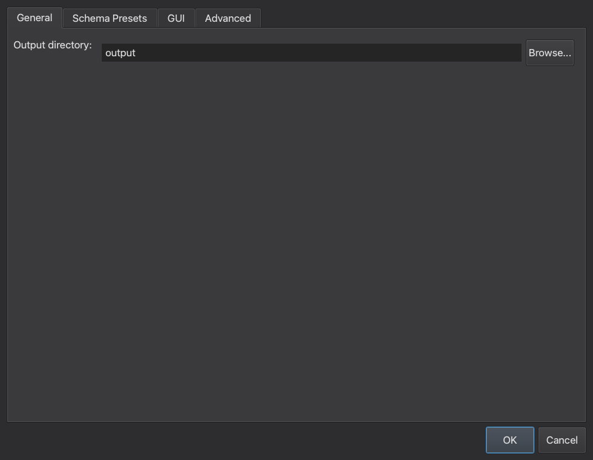
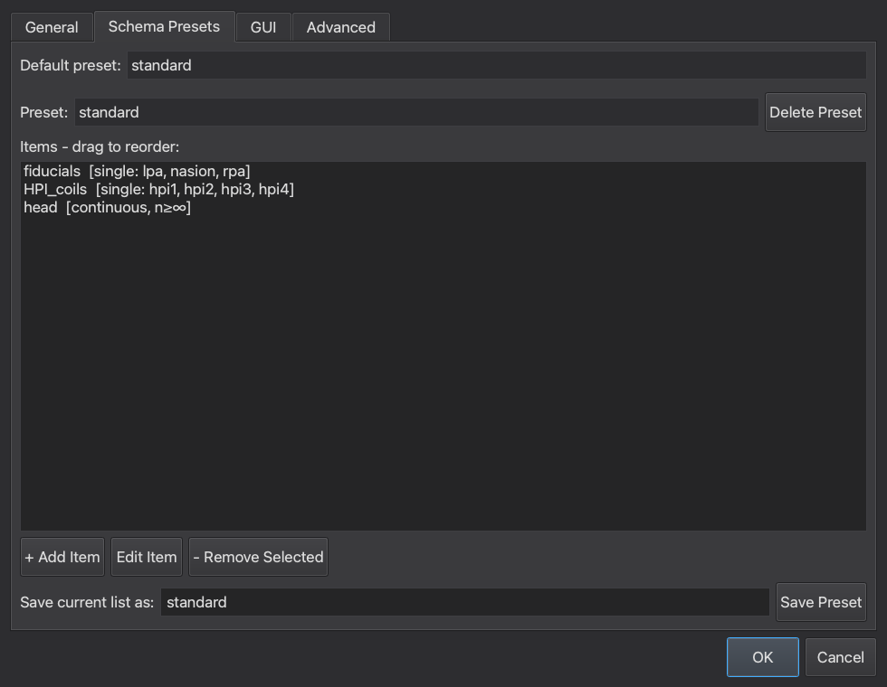
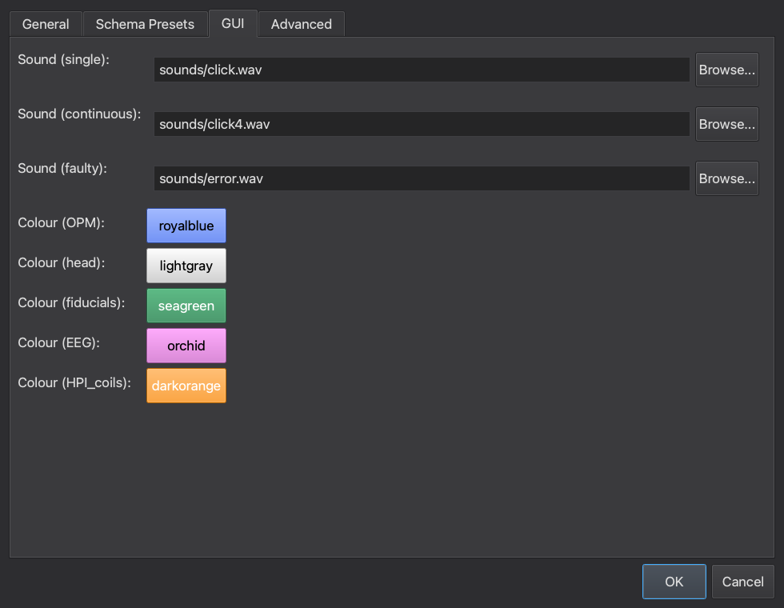
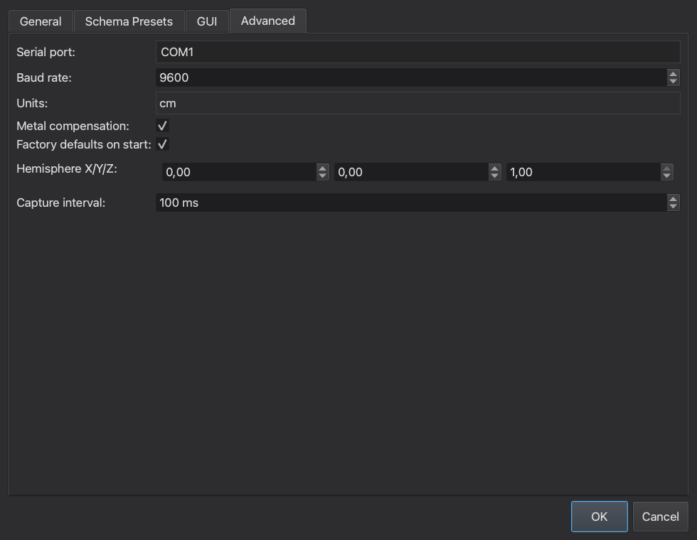

# Settings

`pylhemus` loads settings from multiple layers.

## Resolution order

Settings are merged in this order, from lowest to highest priority:

1. Bundled defaults in `pylhemus/default_settings.json`
2. User settings in the per-user config directory
3. Project settings in the current working directory
4. An explicit file passed with `pylhemus gui --settings`

Later layers override earlier ones.

## Settings file locations

User settings path:

- Windows: `%APPDATA%\pylhemus\settings.json`
- macOS and Linux: `~/.pylhemus/settings.json`

Project settings path:

- `pylhemus.settings.json` in the current working directory

Legacy user settings at `default_settings.json` inside the user config directory are migrated automatically to `settings.json`.

## Settings dialog

Open the standalone settings dialog with:

```bash
pylhemus settings
```

The dialog edits the user settings file only:

- Windows: `%APPDATA%\pylhemus\settings.json`
- macOS and Linux: `~/.pylhemus/settings.json`

Project overrides in `pylhemus.settings.json` still apply when you launch the main GUI, so the dialog is best used for machine-local defaults.

### General tab

Use the **General** tab to set the default output directory for saved digitisation sessions.



### Schema Presets tab

Use **Schema Presets** to:

- choose the default preset shown in the startup dialog
- add, edit, delete, and rename preset definitions
- drag items to reorder them
- save user-specific schema presets on top of the bundled defaults

Continuous items must stay last in the preset order.



### GUI tab

Use the **GUI** tab to customise:

- point sounds for `single`, `continuous`, and `faulty` events
- category colours used in the digitisation interface



### Advanced tab

Use the **Advanced** tab for FASTRAK and acquisition defaults:

- serial port and baud rate
- units (`cm` or `inch`)
- metal compensation
- factory defaults on startup
- hemisphere vector
- capture interval



When you click **OK**, the dialog shows a confirmation summary of the changed settings before writing them to disk.

## Common fields

Typical top-level settings include:

- `serial_port`
- `serial_baud`
- `digitisation.output_dir`
- `digitisation.capture_interval_ms`
- `digitisation.default_schema_preset`
- `digitisation.schema_presets`

## Example

```json
{
  "serial_port": "COM3",
  "serial_baud": 9600,
  "digitisation": {
    "output_dir": "output",
    "default_schema_preset": "standard"
  }
}
```

## Recommended usage

- Put machine-specific defaults in the user settings file.
- Put study- or project-specific overrides in `pylhemus.settings.json`.
- Use `--settings` for one-off sessions that should not affect normal defaults.
